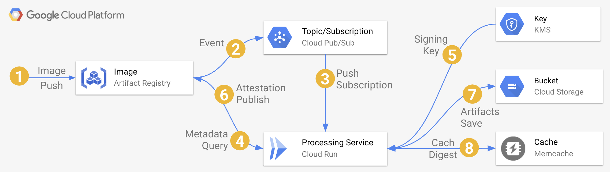

# artomator (Artifact Registry Automator, naming is hard)


[](https://goreportcard.com/report/github.com/mchmarny/artomator)  [](https://github.com/gojp/goreportcard/blob/master/LICENSE)

[Artifact Registry (AR)](https://cloud.google.com/artifact-registry) `artomator` automates signing, creation of [Software Bill of Materials (SBOM)](https://www.cisa.gov/sbom), and vulnerability scanning of container images. When deployed in your project, `artomator` will automatically process any images [labeled](https://docs.docker.com/config/labels-custom-metadata/) expected by `artomator`.

```shell
docker build -t $IMAGE_TAG --label artomator-sbom=true --label artomator-vuln=true .
```

For example, by adding the `artomator-sbom=true` and `artomator-vuln=true` label flags in the above Docker build commend will tell `artomator` to automatically generate both signed SBOM and vulnerability report and add these as attestations to that image.


## how it works



1. Whenever an image is published to the Artifact Registry 
2. A [registry event](https://cloud.google.com/artifact-registry/docs/configure-notifications) is automatically published if there is a [PubSub](https://cloud.google.com/pubsub/docs/overview) topic named `gcr` in the same project
3. PubSub subscription pushes that event to `artomator` service in [Cloud Run](https://cloud.google.com/run) with the operation type (e.g. `INSERT`) and the image digest (SHA256)
4. The `artomator` service retrieves metadata for that image from the registry, signs that image with KMS key, creates the requested artifacts (SBOM or vulnerability report) based on the labels, creates attestation for these artifacts on the original image using the KMS key, and pushes it all the registry
5. The `artomator` service persists the processed image digests in Redis store to avoid processing the same artifact, since technically adding attestation to an image creates yet another event

### OSS tech

* [cosign](https://github.com/sigstore/cosign) for image signing and verification
* [syft](https://github.com/anchore/syft) for SBOM generation 
* [grype](https://github.com/anchore/grype) for vulnerability scans 
* [jq](https://stedolan.github.io/jq/) for JSON operations 

## deployment 

To deploy the prebuilt `artomator` image with all the dependencies run:

> Note, provisioning Redis service may take a few minutes

```shell
make deploy
```

This will:

* Enable required APIs
* Create artifact registry (`artomator`)
* Configure KMS key (`keyRings/artomator/cryptoKeys/artomator-signer`)
* PubSub topic (`gcr`) and subscription to that topic (`gcr-sub`)
* Deploy Cloud Run service (`artomator`) to process the registry events

## build your own

To build the `artomator` image yourself in your own project, first, enable required APIs, create registry, and configure KMS key:

```shell
bin/setup
```

Then, build the `artomator` image locally, sign it, generate its own SBOM with vulnerability report, publish that image to your own registry (created in setup), and run attestation validation to make sure the image is ready for use:

```shell
bin/build
```

Finally, create the PubSub topic with push subscription, and deploy Cloud Run service to process the registry events: 

> Note, the created Cloud Run service requires `roles/run.invoker` roles so only the PubSub push subscription will be allowed to invoke that service. 

```shell
bin/deploy
```

## test deployment

To test the deployed `artomator`, use the provided ["hello" Dockerfile](tests/Dockerfile). To build it with both labels (`artomator-sbom=true` and `artomator-vuln=true`) and deploy it: 

```shell
tests/run
```

## verify processed image

To verify the attestation for `artomator` processed images you will need the KMS key name that was used to sign that image. You retrieve it using the following command:

```shell
export SIGN_KEY=$(gcloud kms keys describe artomator-signer \
  --project $PROJECT_ID \
  --location $REGION \
  --keyring artomator \
  --format json | jq --raw-output '.name')
```

You can check the key like this: 

```shell
echo $SIGN_KEY
```

It should look something like this

```shell
projects/$PROJECT_ID/locations/$REGION/keyRings/artomator/cryptoKeys/artomator-signer/cryptoKeyVersions/1
```

Once have the signing key, you can verify any image that was processed by `artomator` like this:

> Note, the `$IMAGE_DIGEST` has to be the fully qualified image URI with the SHA. For example `us-west1-docker.pkg.dev/cloudy-demos/artomator/tester@sha256:59d5b8eb5525307dde52aa51382676e74240bb79eb92a67a1f2a760382a21d78`

```shell
cosign verify-attestation --type=spdx --key "gcpkms://${SIGN_KEY}" $IMAGE_DIGEST \
    | jq -r .payload | base64 -d | jq -r .predicateType
```

> Note, you can check the attestation for either of the two types that `artomator` creates by changing the `--type` flag in the above command to either `spdx` (SBOM), `vuln` which is the vulnerability report

The result should look something like this: 

```shell
Verification for us-west1-docker.pkg.dev/cloudy-demos/artomator/tester@sha256:59d5b8eb5525307dde52aa51382676e74240bb79eb92a67a1f2a760382a21d78 --
The following checks were performed on each of these signatures:
  - The cosign claims were validated
  - The signatures were verified against the specified public key
https://spdx.dev/Document
```

To save any of these artifacts locally: 

```shell
cosign verify-attestation --type=spdx --key "gcpkms://${SIGN_KEY}" $IMAGE_DIGEST \
    | jq -r .payload | base64 -d > sbom.spdx.json
```

## cleanup

To delete all created resources run: 

```shell
bin/cleanup
```

> Note, this does not remove the created KMS resources. 

## disclaimer

This is my personal project and it does not represent my employer. While I do my best to ensure that everything works, I take no responsibility for issues caused by this code.